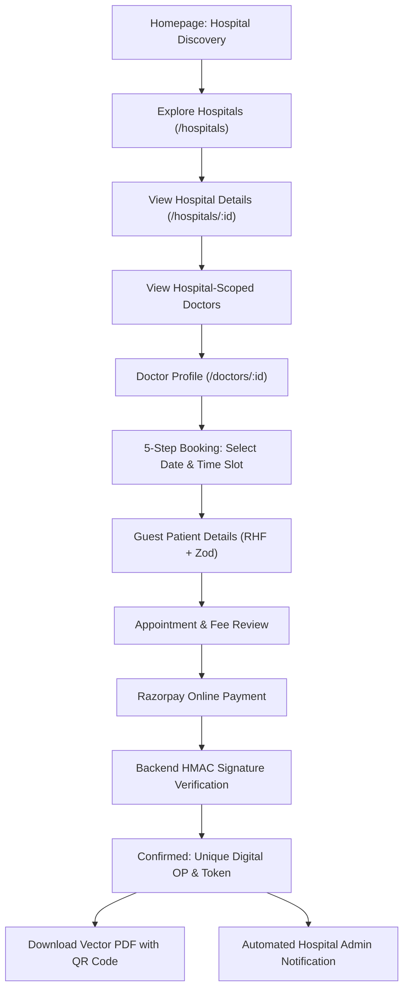

# MediPulse | Multi-Hospital Doctor Appointment Booking Platform

> **Production-Ready Multi-Hospital Healthcare Platform** with zero patient login friction, guaranteed slot locking, Razorpay payment verification, instant Digital OP PDF generation with secure QR verification, and dedicated role-based portals for **Super Admin**, **Hospital Admin**, and **Doctors**.

---

## 🌟 Key Highlights & Core Principles

- **Zero Patient Login Required:** Patients can seamlessly discover hospitals, pick specialized doctors, book appointments, make payments, and download their official Digital OP slip without ever registering or creating an account.
- **Strict Concurrency & Slot Locking:** Doctor schedules, break periods, and leaves are strictly enforced on the server. Double booking is prevented using transactional slot reservation.
- **Razorpay Payment Architecture:** Secure order creation, client-side checkout, backend HMAC-SHA256 signature verification, and idempotent webhook handlers.
- **Official Digital OP Generation:** High-resolution vector PDF slips generated on-demand with embedded cryptographic QR codes, token numbers, and payment verification stamps.
- **Role-Isolated Dashboards:**
  - **Super Admin:** Platform KPIs, hospital network registry, platform convenience revenue, and audit trails.
  - **Hospital Admin:** Hospital-scoped metrics, appointments workflow (`CONFIRMED` → `WAITING` → `IN_CONSULTATION` → `COMPLETED`), doctor roster management, fees, schedules, and automated system alerts.
  - **Doctor OPD Room:** Today's live queue, token management, active consultation suite, diagnosis & digital prescription issuance.
- **Patient Appointment Lookup via OTP (`/check-appointment`):** Allows patients to retrieve their appointment and re-download OP slips using only Appointment ID + Mobile Number via SMS OTP verification (no account creation).

---

## 🏗️ Architecture & Technology Stack

```
op/
├── backend/
│   ├── src/
│   │   ├── config/             # Prisma client & environment variables
│   │   ├── controllers/        # Express route controllers
│   │   ├── middleware/         # JWT auth, role guards, error handling
│   │   ├── routes/             # RESTful API routing endpoints
│   │   ├── services/           # Core business logic & database transactions
│   │   ├── utils/              # PDFKit Digital OP generator, JWT, QR codes
│   │   ├── validators/         # Zod schemas for input validation
│   │   ├── app.ts              # Express application configuration
│   │   └── server.ts           # Server bootstrap with graceful shutdown
│   ├── prisma/
│   │   ├── schema.prisma       # Active Prisma schema (SQLite dev / Postgres prod)
│   │   ├── schema.postgresql.prisma # Production PostgreSQL schema
│   │   └── seed.ts             # Realistic Indian healthcare dataset seeder
│   └── Dockerfile              # Multi-stage production container
├── frontend/
│   ├── src/
│   │   ├── api/                # Modular API service clients
│   │   ├── components/         # Reusable UI components & layouts
│   │   ├── context/            # Authentication & toast notification contexts
│   │   ├── layouts/            # Public, Hospital Admin, Doctor, Super Admin layouts
│   │   ├── pages/              # Responsive healthcare application pages
│   │   ├── types/              # Comprehensive TypeScript interfaces
│   │   ├── App.tsx             # Client routing hierarchy
│   │   └── main.tsx            # React application entry point
│   ├── nginx.conf              # Production Nginx reverse proxy configuration
│   └── Dockerfile              # Multi-stage Nginx container
├── docker-compose.yml          # Full-stack production orchestration (Postgres + Redis + API + Web)
└── test_e2e.js                 # Automated end-to-end integration test suite
```

### Technology Matrix

| Layer | Technologies |
|---|---|
| **Frontend** | React 18, TypeScript, Vite, Tailwind CSS, React Router v6, TanStack Query v5, React Hook Form, Zod, Lucide Icons, QRCode.react |
| **Backend** | Node.js, Express, TypeScript, Prisma ORM, PDFKit, QRCode, Helmet, Morgan, Express Rate Limit, bcryptjs, jsonwebtoken |
| **Database** | SQLite (zero-dependency instant run) / PostgreSQL (production ready) |
| **Payments** | Razorpay Gateway (HMAC-SHA256 signature verification & idempotent webhooks) |
| **DevOps** | Docker, Docker Compose, Nginx, Multi-stage builds |

---

## 🚀 Quick Start Guide

### Prerequisites
- Node.js >= 18.0.0
- npm >= 9.0.0

### 1. Install & Seed
The database has already been synchronized and seeded with 5 premier hospitals, 8 clinical departments, 17 specialized doctors, and sample appointments. To re-seed at any time:

```bash
# In project root:
npm run seed --workspace=backend
```

### 2. Run the Platform
To run both backend API and frontend client concurrently:

```bash
# Run backend (Port 5000):
npm run dev --workspace=backend

# Run frontend (Port 5173):
npm run dev --workspace=frontend
```

Open your browser at **`http://localhost:5173`**.

---

## 🔐 Demo Credentials

All test accounts use the password: **`Password@123`**

| Role | Email | Access Scope |
|---|---|---|
| **Super Admin** | `superadmin@medipulse.org` | National Platform Oversight, All Hospitals, Platform Revenue |
| **Hospital Admin (Apollo)** | `admin.apollo@medipulse.org` | Apollo Jubilee Hills appointments, doctors, rosters & revenue |
| **Hospital Admin (Fortis)** | `admin.fortis@medipulse.org` | Fortis Bengaluru appointments, doctors, rosters & revenue |
| **Hospital Admin (Max)** | `admin.max@medipulse.org` | Max Saket appointments, doctors, rosters & revenue |
| **Doctor (Apollo - Cardiology)** | `dr.rahul@apollo.medipulse.org` | Dr. Rahul Kumar's OPD Queue, Patient Consultations & Prescriptions |
| **Doctor (Fortis - Gen Med)** | `dr.rajesh@fortis.medipulse.org` | Dr. Rajesh Mehta's OPD Queue & Clinical Records |

*(Quick 1-click fill buttons are provided on `/staff/login` for instant testing).*

---

## 🩺 Patient User Experience Flow



---

## 🧪 Automated End-to-End Verification

The project includes an automated end-to-end integration test script verifying slot locking, double-booking prevention, Razorpay signature verification, Digital OP generation, QR verification, and hospital admin system notifications:

```bash
node test_e2e.js
```

**Results:**
- ✅ Available slot calculation with working days & break periods
- ✅ Slot locking with double-booking prevention
- ✅ Atomic database transaction confirming payment & generating `OP-YYYY-MMDD-XXXXXX`
- ✅ QR code endpoint verification returning minimal safe data
- ✅ On-demand vector PDF stream generation
- ✅ Real-time system notifications formatted for Hospital Admin

---

## 🐳 Production Docker Deployment

To launch the full production environment with PostgreSQL 16, Redis, Express Backend, and Nginx Frontend:

```bash
docker-compose up --build -d
```

Access the production frontend at `http://localhost` and backend API at `http://localhost:5000`.
